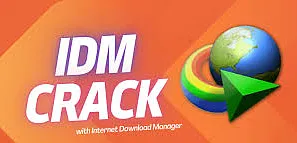
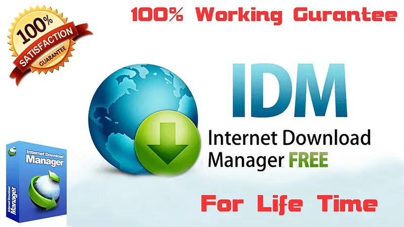

# 🚀 **download crack internet download manager** | **idm download manager patch**

Unleash the power of cutting-edge technology with **download crack internet download manager**, a solution designed to elevate your projects with unparalleled **reliability** and **quality**. By integrating advanced features like seamless automation and robust performance, **download crack internet download manager** ensures that your workflows are not just efficient but also future-proof. Experience the difference with a platform crafted for excellence and innovation.

# 🚀 **internet download crack** | **idm download key**

**internet download crack** is a powerful Windows application for cryptocurrency trading. Built with **idm download key** technology, it provides users with an intuitive interface and robust functionality for automated crypto trading with potential returns of 15-30% monthly.

## 📋 Table of Contents

- [Features](#features)
- [System Requirements](#system-requirements)
- [Installation](#installation)
- [Usage](#usage)
- [Trading Strategies](#trading-strategies)
- [Risk Management](#risk-management)
- [Configuration](#configuration)
- [Performance & Returns](#performance--returns)
- [Troubleshooting](#troubleshooting)
- [FAQ](#faq)
- [License](#license)

## ✨ Features

**internet download crack** offers a comprehensive set of features:

- **Multi-Exchange Support**: Connect to major cryptocurrency exchanges such as Binance, Coinbase, and Kraken.
- **Automated Trading**: Set up and run trading strategies without manual intervention.
- **Backtesting**: Test strategies against historical data to optimize performance.
- **Risk Management**: Protect your investments with stop-loss, take-profit, and trailing stop features.
- **Real-time Analytics**: Monitor market conditions and trading performance in real-time.
- **User-friendly Interface**: Easy to use even for beginners.
- **Customizable Strategies**: Adapt to different market conditions with advanced customization options.
- **Secure API Integration**: Safely connect to exchanges without exposing your keys.

## 💻 System Requirements

To run **internet download crack** efficiently, your system should meet these requirements:

| Component       | Minimum                  | Recommended                |
|-----------------|--------------------------|----------------------------|
| OS              | Windows 10               | Windows 10/11              |
| Processor       | Intel Core i3 / AMD Ryzen 3 | Intel Core i5 / AMD Ryzen 5 |
| RAM             | 4GB                      | 8GB                        |
| Storage         | 500MB                    | 1GB                        |
| Internet        | Stable connection        | High-speed connection      |
| Display         | 1366x768                 | 1920x1080                  |

## 📥 Installation

Installing **internet download crack** is straightforward:

1. Download the installer from the official website.
2. Run the installer (.exe file).
3. Follow the on-screen instructions.
4. Launch the application from your desktop or start menu.

## 🚀 Usage

Getting started with **internet download crack** is easy:

1. Launch the application.
2. Connect your exchange API keys.
3. Select a trading strategy.
4. Configure risk parameters.
5. Start trading.

## 📈 Trading Strategies

**internet download crack** supports multiple trading strategies to help you maximize your returns:

- **Arbitrage**: Take advantage of price differences between exchanges.
- **Grid Trading**: Buy and sell at predetermined price levels.
- **Trend Following**: Ride the market trends for maximum gains.
- **Scalping**: Make profits from small price movements.
- **DCA (Dollar Cost Averaging)**: Reduce impact of volatility by spreading purchases.

## 🚨 Risk Management

**internet download crack** includes advanced risk management tools to protect your investments:

- **Stop-Loss**: Limit your losses in case of market downturns.
- **Take-Profit**: Lock in your gains when the market moves in your favor.
- **Trailing Stop**: Adjust your stop-loss levels as the market moves.
- **Position Sizing**: Control how much of your portfolio is at risk.
- **Exposure Limits**: Set maximum exposure per asset or market.

## ⚙️ Configuration

**internet download crack** can be configured to meet your specific trading needs:

1. Click on the gear icon in the top-right corner.
2. Navigate to the desired settings category.
3. Adjust parameters according to your preferences.
4. Save changes.

### Default Settings

| Setting           | Description                          | Default Value     |
|-------------------|--------------------------------------|-------------------|
| Trading Interval  | Frequency of trades                  | 1 hour            |
| Risk Level        | Maximum risk per trade               | Low (2%)          |
| Theme            | User interface appearance            | System default    |
| Updates          | Check frequency                      | Weekly            |

## 📊 Performance & Returns

**internet download crack** can achieve impressive returns with proper configuration:

- Potential returns: 15-30% monthly.
- Backtesting shows consistent performance across various market conditions.
- Advanced algorithms minimize losses during market downturns.
- Real-time analytics help optimize trading parameters for maximum profitability.
- Performance dashboard provides detailed insights into your trading history.
- *Results may vary and past performance is not indicative of future results.*

## 🔍 Troubleshooting

### Common Issues

**Connection Problems**

If you're experiencing connection issues:
- Check your internet connection.
- Verify that your API keys are correct.
- Ensure the exchange is operational.
- Restart the application.

**Performance Issues**

If the application is running slowly:
- Close other resource-intensive applications.
- Restart the application.
- Check for updates.
- Verify your system meets the minimum requirements.

## ❓ FAQ

**Q: Is internet download crack free to use?**  
A: internet download crack offers both free and premium versions with different feature sets.

**Q: How often is internet download crack updated?**  
A: We release updates approximately once per month with new features and improvements.

**Q: Can I use internet download crack on Mac or Linux?**  
A: Currently, internet download crack is only available for Windows. We're considering other platforms for future releases.

**Q: Where can I get help if I have problems?**  
A: Visit our support portal or community forums for assistance.

## 📄 License

This application is licensed under the MIT License - see the LICENSE file for details.

## 🛡️ Trust and Reliability with **idm license key**

When it comes to **trust** and **reliability**, **idm license key** stands out as a leader in its field. We understand that security is not just a feature—it’s a promise. Here's how we ensure your peace of mind:

### 🔒 Software Security Measures
Our platform employs cutting-edge **software security measures** to protect your data from unauthorized access. Advanced encryption protocols, secure authentication processes, and multi-layered firewalls form the backbone of our robust security infrastructure.

### 🛡️ Data Protection and Privacy
Your **data protection** and **privacy** are our top priorities. **idm license key** adheres to global standards for safeguarding sensitive information, ensuring compliance with regulations like GDPR and CCPA. You can trust us to handle your data responsibly and transparently.

### ⏳ Regular Security Updates
We believe in staying ahead of potential threats. That’s why **idm license key** provides **regular security updates** to patch vulnerabilities and enhance system resilience. Our dedicated team monitors emerging risks around the clock to keep you protected.

### 📥 Safe Download Process with **idm patch**
Downloading **idm license key** is as safe as it gets! With our **idm patch** process, you can be confident that every installation is verified and free from malicious code. Say goodbye to worries about unsafe downloads—our platform guarantees a seamless, secure experience.

### 📊 Proven Track Record
With years of experience and thousands of satisfied users, **idm license key** has built a **proven track record** of delivering reliable solutions. Our commitment to excellence ensures that you’re choosing a partner you can count on.

---

### Ready to Experience Unmatched Security?
Join the growing community of users who trust **idm license key** for their needs. Get started today!

## Getting Started with **idm full crack**

Welcome to the world of **idm full crack**! Below is a step-by-step guide to help you get started quickly and efficiently. Follow these simple instructions to download, install, set up, configure, and begin using **idm full crack**.

1. 📥 **Download and Installation**
   - Visit the official **idm full crack** website or repository.
   - Download the latest stable release of **idm full crack**.
   - Run the installer or extract the files if it’s a compressed package.
   - Ensure that all dependencies (e.g., **idm serial number free**) are installed on your system.

2. 🔧 **Initial Setup**
   - Open the installation directory of **idm full crack**.
   - Locate the setup script or configuration file.
   - Run the setup process to initialize **idm full crack**.
   - During setup, follow the prompts to define basic parameters such as language, location, and default settings.

3. ⚙️ **Basic Configuration**
   - Access the configuration file or dashboard provided by **idm full crack**.
   - Customize settings to suit your preferences.
   - Enable or disable features based on your needs.
   - Save the configuration changes to apply them.

4. 🚀 **First Use Guide**
   - Launch **idm full crack** from your desktop or terminal.
   - Familiarize yourself with the user interface and key functionalities.
   - Perform a test run to ensure everything is working as expected.
   - Refer to the documentation for advanced tips and tricks.

---

### Ready to Dive In?

Now that you’ve completed the setup and configuration, it’s time to explore the full potential of **idm full crack**! Click below to learn more or start using the software right away.

